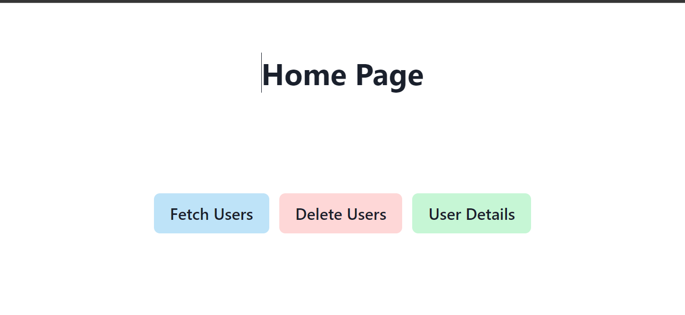
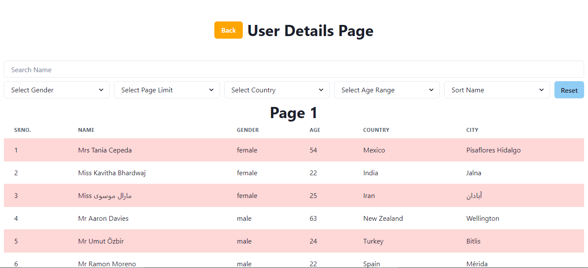
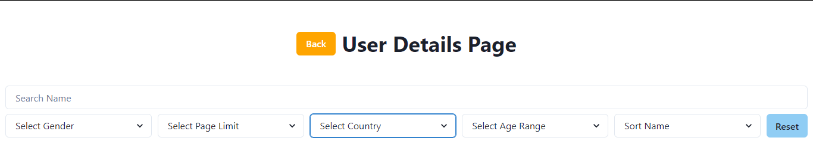
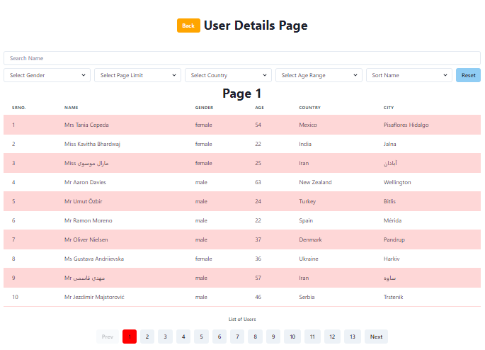

# coinTab_FrontEnd
## Deployed Link
1.  Backend Link - https://tough-lamb-tutu.cyclic.app/
1.  Frontend Link - https://coin-tab-front-end.vercel.app/

## GitHub Backend Link - https://github.com/AshishKohad27/coinTab_BackEnd

<br/>
<br/>

## Build with

<table  align=center>
  <tr>
      <td align=center> </td>
 <td align=center> </td>
    <td align=center> </td>
     <td align=center> </td>
  </tr><tr><td align=center>  </td>
   <td align=center> </td>
  <td align=center> </td>
  <td align=center> </td>
  </tr>
</table>

<hr/>

## Functionalities

- Home Page
- User Details Page

## Project as

- ### **Frontend**
- ### **Backend**

<br/><br/>

# 🧑🏻 **Ashish Kohad**

- Github:[@Ashish Kohad](https://github.com/AshishKohad27)
- Linkedin: [Ashish Kohad](https://www.linkedin.com/in/ashish-kohad27/)
- Email: (kohadashish27@gmial.com)

<br/><br/>

# ** Tech Stacks used **

<ul>
<li>Javascript</li>
<li>HTML</li>
<li>CSS</li>
<li>React</li>
<li>Redux</li>
<li>NextJs</li>
<li>ExpressJs</li>
<li>MongoDB</li>
</ul>

<h3><i>External libraries used </i></h3>

<ul>
<li>Chakra UI</li>
<li>React Router DOM</li>
<li>React Redux</li>
<li>Redux Thunk</li>
<li>Axios</li>
</ul>

</br>

# FontEnd Side

# Home Page


</br>

# Delete User Functionality


</br>

# User Details Page


</br>

# Filter functionality


</br>

# Pagination


</br>

# Backend Side

## Build REST API's with

- NodeJs
- ExpressJs

## Data Stored in MongoDB

</br>

## Steps of starting Backend

1. Run `npm run start` on terminal
2. You will get `URL` like this `http://localhost:7879` server running on port number `7879`

## Methods

# 1. Get Data

### getUrl :- `http://localhost:7879/data/filter`

## Data can able to filter , sorted, paginated with this methods

- We can use filter, sort, pagination, search together

```javascript
http://localhost:7879/data/filter?gender=&page=1&limit=60&name=f&ageL=80&ageR=70&country=Ireland&sortName=desc
```

### list of filter

1. Filter by Age

- range ageL : above that limit
- range ageR : below that limit
- both should use together

```javascript
getUrl?ageR=50&ageL=70;
```

2. Filter by Country

```javascript
getUrl?country=Ireland
```

3. Filter by Gender
   gender= male/female/""

```javascript
getUrl?gender=male
```

### Sort

1. Sort Data base on Nama

- Ascending order (asc)
- Descending order (desc)

```javascript
getUrl?sortName=desc
```

### Pagination

1. page (1 by default)
2. limit (10 by default)

- Prev Button
- Next Button
- Land any Page directly by clicking on particular page Number

```javascript
getUrl?page=1&limit=10
```

### Search Functionality

- Search any user by typing character in query

```javascript
  getUrl?name="as"
```

# 2. Add Data

- Adding data done with this api

```
https://randomuser.me/
```

- Bulk Data added in the data base in the range of 50 to 100 every time data added it give diff. data length in the range of 50 to 100.

# 3. Delete Data
